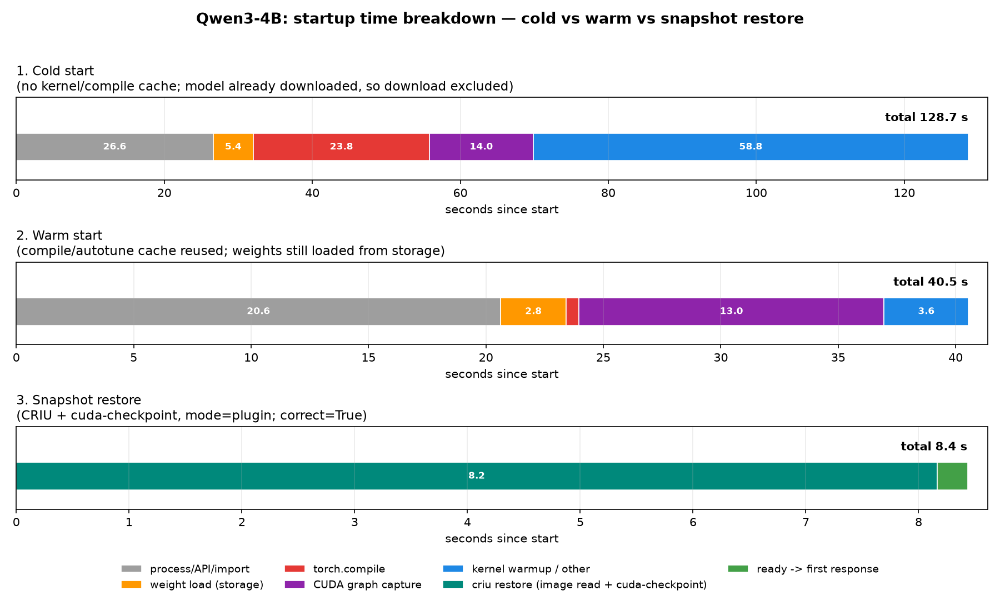

# vLLM snapshot / restore (CRIU + `cuda-checkpoint`)

Non-Kubernetes snapshot/restore for a warm vLLM worker, using CRIU + NVIDIA
`cuda-checkpoint`, to cut **start restore → first correct inference** from
minutes to seconds on a single GPU.



**Headline (RTX 4060 Ti 16 GB):** cold start **130 s** → warm **40 s** →
**snapshot restore 8.4 s**, one correct inference. The MoE model is the same
(`images/startup_breakdown_moe.png`).

---

## 1. What this is

We checkpoint a *warm, quiesced* vLLM worker with CRIU (process state) plus
`cuda-checkpoint` (GPU state), kill it, restore it, and serve an inference. The
snapshot captures the CUDA context, compiled graphs, and allocator state that a
normal warm restart still has to rebuild — only the weight bytes still cross
disk.

Measured workloads (device-resident on 16 GB):

| Role | Model | GPU weights |
| --- | --- | ---: |
| dense | `Qwen/Qwen3-4B` (bf16) | 7.56 GiB |
| MoE | `Qwen/Qwen1.5-MoE-A2.7B-Chat-GPTQ-Int4` (4-bit) | 7.91 GiB |

`gpt-oss-20b` (13.8 GB MXFP4) does **not** fit 16 GB without CPU offload and is
excluded.

### Results

| Model | cold ready | warm ready | restore→ready | restore→first resp. | vs warm | vs cold |
| --- | ---: | ---: | ---: | ---: | ---: | ---: |
| Qwen3-4B | 130.5 s | 40.5 s | 8.17 s | **8.44 s** | 4.8× | 15.5× |
| MoE (GPTQ-Int4) | 108.8 s | 36.4 s | 8.47 s | **8.58 s** | 4.2× | 12.7× |

Detailed per-phase narrative: [`report.md`](report.md). Independent verifier
verdicts: [`results/verification/`](results/verification/). Exact stack:
[`results/stack.txt`](results/stack.txt).

### Why restore is ~constant across models

Both configs use `--gpu-memory-utilization 0.9`, so vLLM sizes the KV cache to
fill the card. The checkpoint captures **all device memory** (weights + KV +
activations + context) plus host pages:

```
S ≈ u·V + H                              (VRAM-filling regime, u = util, V = VRAM)
T_restore ≈ S / B_eff + t_ctx            B_eff ≈ 2.0 GB/s on this NVMe/driver
```

Both images are **~17 GB** → both restore in ~8.5 s. Image composition (Qwen3-4B)
is one 16 GB `pages-10.img` (device→host copy of weights+KV) + ~1 GB host,
uncompressed.

### How the times scale

```
T_cold ≈ P + W + C(L) + G(L,b) + U       (P=process/API, W=weights, C=compile,
T_warm ≈ P + W + G(L,b)                   G=graph capture, U=warmup/autotune)
T_restore ≈ S / B_eff
S ≈ u·V + H                    (KV fills the card)
S ≈ W + KV + A + H             (KV capped / slept / weights-in-image)
```

| term | grows with | Qwen3-4B cold/warm | MoE cold/warm |
| --- | --- | ---: | ---: |
| `P` process/API/import | ~constant | 28.9 / 20.6 | 24.9 / 17.5 |
| `W` weight load | bytes ÷ read BW | 5.4 / 2.8 | 5.5 / 5.5 |
| `C` torch.compile | **layers/structure** | 23.8 / 0.5 | 8.4 / 0.1 |
| `G` CUDA graph capture | **layers × capture sizes** | 14.0 / 13.0 | 11.0 / 9.0 |
| `U` kernel warmup/autotune | kernel set | 60.4 / 3.1 | 58.9 / 4.4 |

Weight read is I/O- and format-dependent: bf16 ~2.0 GiB/s cold (disk) vs
~7.3 GiB/s warm (page cache); 4-bit GPTQ ~2.9 GiB/s (dequant bound). Cold is
dominated by `C+G+U`; warm still re-pays `W` and `G`; snapshot removes them all.

Projections: 80 GB card (u=0.9) → S≈75 GB → ~37 s; 500B-class 4-bit capped →
S≈275 GB (weights-dominated) → ~135 s, the case Phase 9 targets.

---

## 2. Install

This repo is standalone tooling. It assumes **vLLM is installed in a Python
environment** (so `vllm serve` and `python` are available); it does not need the
vLLM source tree. Tested on Ubuntu 22.04, 1× NVIDIA GPU (driver ≥ 570; here
580.178.04).

```bash
# 1. vLLM in this repo's venv — pinned to the precompiled build tested here
#    (commit 8263ea12bd, cu130; no local build)
uv venv --python 3.12 .venv          # or: python3 -m venv .venv
source .venv/bin/activate
uv pip install "vllm==0.29.1rc1.dev134+g8263ea12b" \
  --extra-index-url https://wheels.vllm.ai/8263ea12bd8fa7584277f5200d521193259707b7/cu130/ \
  --torch-backend=auto
# out-of-tree plugin: reload weights in place after sleep level 2 (Phase 9)
uv pip install -e plugin
# The scripts auto-detect this repo's .venv. If vLLM is installed elsewhere,
# export VLLM_HOME=/dir/containing/.venv (and pass it through sudo for dumps).

# 2. CUDA toolkit (nvcc; needed for JIT warmup)
wget https://developer.download.nvidia.com/compute/cuda/repos/ubuntu2204/x86_64/cuda-keyring_1.1-1_all.deb
sudo dpkg -i cuda-keyring_1.1-1_all.deb && sudo apt-get update
sudo apt-get install -y --no-install-recommends cuda-toolkit-13-2

# 3. CRIU >= 4.0 + CUDA plugin. Use the fork that carries the link-remap reuse fix;
#    alternatively apply patches/criu-link-remap-reusable.patch to upstream CRIU.
sudo apt-get install -y build-essential pkg-config protobuf-c-compiler \
  libprotobuf-c-dev libprotobuf-dev protobuf-compiler libnl-3-dev \
  libnl-route-3-dev libnet1-dev libcap-dev python3-protobuf libbsd-dev \
  uuid-dev libaio-dev iproute2
git clone git@github.com:eliird/CRIU-multiprocess.git /tmp/criu
( cd /tmp/criu && make -j"$(nproc)" all && \
  sudo make install-lib install-crit install-criu install-compel install-cuda_plugin && \
  sudo install -m 0755 plugins/cuda/cuda_plugin.so /usr/lib/criu/cuda_plugin.so )
# (plain `make install` also builds man pages, which needs asciidoc)

# 4. cuda-checkpoint (NVIDIA ships a prebuilt binary)
git clone https://github.com/NVIDIA/cuda-checkpoint.git /tmp/cuda-checkpoint
sudo install -m 0755 /tmp/cuda-checkpoint/bin/x86_64_Linux/cuda-checkpoint /usr/local/bin/cuda-checkpoint

# 5. Model
hf download Qwen/Qwen3-4B
```

Verify:

```bash
nvidia-smi --query-gpu=name,driver_version,memory.total,compute_cap --format=csv
criu --version && ls /usr/lib/criu/cuda_plugin.so
cuda-checkpoint --help 2>&1 | head -2
python -c "import vllm, torch; print(vllm.__version__, torch.cuda.is_available())"
```

> The scripts find vLLM in this repo's `.venv` (or `$VLLM_HOME/.venv`); run outputs
> (`logs/`, `plots/`, `snapshots/`) stay in this repo.

---

## 3. Reproduce the 3 runs (Qwen3-4B)

Workflow: cold (no compile cache) → warm (cache reused) → snapshot → restore.
Run all commands **from this repo's root**, with the venv active. Outputs land in
`logs/` and `plots/` (both gitignored). Snapshot/restore steps need root.

> **Before every run, stop any previously-running vLLM engine** (and any hung
> `criu restore`): `bash scripts/stop_vllm.sh [--shm] [PORT...]`. A leftover
> restored worker holds the port/GPU and makes the next `criu restore` fail with
> `Can't fork for <pid>: File exists`. Use `--shm` **only before a snapshot**
> (never between dump and restore).

```bash
# Run 1 — cold start (clears ~/.cache/vllm, torch/inductor, triton, flashinfer)
bash scripts/stop_vllm.sh 8400
MODEL=Qwen/Qwen3-4B PORT=8400 TAG=qwen3_4b_cold CLEAR_CACHE=1 \
  MAX_MODEL_LEN=4096 GPU_MEM_UTIL=0.90 \
  bash scripts/p1_baseline.sh 2>&1 | tee logs/run_cold.log

# Run 2 — warm start (reuse the compile cache)
bash scripts/stop_vllm.sh 8401
MODEL=Qwen/Qwen3-4B PORT=8401 TAG=qwen3_4b_warm CLEAR_CACHE=0 \
  MAX_MODEL_LEN=4096 GPU_MEM_UTIL=0.90 \
  bash scripts/p1_baseline.sh 2>&1 | tee logs/run_warm.log

# Run 3a — snapshot a warm worker (--shm cleans /dev/shm BEFORE the snapshot)
bash scripts/stop_vllm.sh --shm 8411
sudo env MODEL=Qwen/Qwen3-4B PORT=8411 TAG=qwen3_4b \
  MODE=plugin IMG=/tmp/p4_snap_qwen3_4b MAX_MODEL_LEN=4096 GPU_MEM_UTIL=0.90 \
  timeout 900 bash scripts/p4_snapshot_vllm.sh 2>&1 | tee logs/run_snapshot.log

# Run 3b — restore and verify one inference (do NOT clean /dev/shm here)
bash scripts/stop_vllm.sh 8411
sudo env MODEL=Qwen/Qwen3-4B PORT=8411 TAG=qwen3_4b \
  MODE=plugin IMG=/tmp/p4_snap_qwen3_4b EXPECT=Paris \
  timeout 600 bash scripts/p4_restore_vllm.sh 2>&1 | tee logs/run_restore.log

# Plot cold vs warm vs restore
.venv/bin/python scripts/p1_visualize_breakdown.py \
  --cold-log logs/p1_qwen3_4b_cold_vllm.log \
  --warm-log logs/p1_qwen3_4b_warm_vllm.log \
  --restore-json logs/p4_qwen3_4b_restore_times.json \
  --label Qwen3-4B --out plots/startup_breakdown_qwen3_4b.png
```

For the **Phase 9 tiny-image** path (3.4 GB), add `SLEEP=2` to the 3a/3b `env`
lines and install the plugin (see §4).

> If vLLM is not in this repo's `.venv`, add `VLLM_HOME=/dir/containing/.venv` to
> each `sudo env` line and use `"$VLLM_HOME/.venv/bin/python"` for the plot.

Swapping `MODEL`/`TAG` gives the MoE run
(`Qwen/Qwen1.5-MoE-A2.7B-Chat-GPTQ-Int4`, port 8420). Full runbook details
(caveats, cleanup, expected values) are in the issue list below.

### Layout

| Path | Purpose |
| --- | --- |
| `scripts/` | reusable: `p1_baseline.sh`, `p1_parse_breakdown.py`, `p1_visualize_breakdown.py`, `p4_snapshot_vllm.sh`, `p4_restore_vllm.sh`, `p6_sleep_test.sh`, `snapshot-manager`, `stop_vllm.sh` |
| `scripts/dev/` | one-off/test probes (gitignored) |
| `patches/` | `criu-link-remap-reusable.patch` (also in the CRIU fork) |
| `plugin/` | out-of-tree vLLM plugin: in-place weight reload after `sleep(level=2)` |
| `results/` | `stack.txt`, `verification/` |
| `images/` | figures embedded in this README (tracked) |
| `vllm.lock` | vLLM version this was tested against (scripts use repo `.venv` or `$VLLM_HOME`) |
| `logs/`, `plots/`, `snapshots/` | run outputs (gitignored) |

---

## 4. Phase progress

### Phase 6/7 — sleep / KV discard

`/sleep?level=1` offloads weights to CPU pinned RAM and discards the KV cache
(no SSD involved; `level=2` discards both with no backup).

| | Full worker | Slept worker (`level=1`) |
| --- | ---: | ---: |
| GPU memory before dump | 14.8 GiB | **1.81 GiB** |
| Image on disk | 17.1 GB | **14.7 GB** (−2.3) |
| CRIU dump | 13–15 s | 8.8 s |
| `criu restore` call | 8.0–8.7 s | **4.7 s** |
| restore → first response | 8.44 s | **7.95 s** |
| correctness | PASS | PASS |

vLLM reports: `sleep freed 12.07 GiB … 7.72 GiB backed up in CPU … 4.36 GiB
discarded … 1.81 GiB still in use`. Diagnosis (`crit` on the images): the model
file is not mmap'd into the image; the slept image is dominated by the **7.72 GiB
weights CPU backup** + host/CUDA-driver memory. The 4.36 GiB KV discard only
netted **−2.3 GB** on disk because ~2 GB of host/driver bookkeeping (and 7→158
shm segments) reappears after sleep.

**Conclusion:** KV placeholding saves nothing (KV is already discarded); the
lever is **Phase 9 — keep weights out of the image** (`level=2` + reload/resident
weights).

### Phase 8 — restore profile

Slept (`level=1`) restore decomposition:

| Stage | Time |
| --- | ---: |
| `criu restore` (read 14.7 GB image + restore host pages) | 3.6 s (~4 GB/s) |
| `wake_up` (host→device weights ~7.7 GB + KV realloc) | ~0.9 s |
| ready after wake | ~2.0 s |
| first response | +0.27 s |
| **total restore → first response** | **6.8 s** |

### Phase 9 — weight separation / small-image restore  *(done)*

`sleep(level=2)` discards weights and KV with **no CPU backup**
(`0.00 GiB backed up; 13.37 GiB discarded`). The `vllm-snapshot-plugin` then
reloads the weights **in place** after wake, so the tiny image serves correctly.

| | Full | Slept L1 | **Slept L2 + plugin** |
| --- | ---: | ---: | ---: |
| Image | 17.1 GB | 14.7 GB | **3.4 GB** |
| CRIU dump | 13–15 s | 8.8 s | **2.0 s** |
| GPU after sleep | — | 1.8 GiB | 1.3 GiB |
| `criu restore` | 8.0–8.7 s | 4.7 s | **1.7 s** |
| weights reload | — | — | **1.0 s** (in place) |
| restore → first response | 8.44 s | 7.95 s | **5.27 s** |
| correct? | yes | yes | **yes** (`" Paris."`) |

**Completing this needed one out-of-tree piece:** `Worker.sleep(level=2)` saves
only buffers, and `wake_up` leaves the weight **parameters** empty. The plugin
(`plugin/`, installed via the `vllm.general_plugins` entry point) wraps the worker
so a level-2 wake calls the model loader's documented standalone
`load_weights(model, model_config)` **in place** — preserving tensor addresses so
compiled kernels and CUDA graphs stay valid. No vLLM core changes.

Build: `uv pip install -e plugin` (into the vLLM venv). Then snapshot/restore
with `SLEEP=2` as in §3. This is the best configuration on both size and restore
time.

---

## 5. Open issues and roadmap

### 5.1 `/dev/shm` link-remap made snapshots one-shot  *(fixed)*
vLLM's engine runs in a Python multiprocessing child; CPython creates POSIX
semaphores `/dev/shm/sem.mp-*` (hard-linked twice). CRIU needs `--link-remap`,
but the `link_remap.*` temp was consumed/renamed by the first restore, so later
restores failed with
`Can't link dev/shm/link_remap.N -> dev/shm/sem.X: No such file or directory`.

**Fix:** a small CRIU patch, `patches/criu-link-remap-reusable.patch`, recreates
the missing `link_remap.*` source (sized from the dumped file) and retries the
link, making images reusable. Maintained as a fork of CRIU:
**https://github.com/eliird/CRIU-multiprocess** (branch
`snapshot/link-remap-reusable`, set as the default branch; commit
"restore: recreate missing link-remap source so images are reusable"). Verified:
the **same image restored twice** (8.31 s then 8.04 s, both correct). Build it
from the fork (`git clone`, `make`, `make install-criu install-cuda_plugin`, copy
`cuda_plugin.so` to `/usr/lib/criu/`) or `git am` the patch onto upstream CRIU.

> Reaping the restored process tree fully between restores matters: a leftover
> process makes the next restore fail with `Can't fork for <pid>: File exists`.
> (Running vLLM single-process `VLLM_ENABLE_V1_MULTIPROCESSING=0` also avoids the
> semaphores, but costs performance.)

### 5.2 Image size = full device state  *(optimization)*
Images (~17 GB) capture the entire GPU footprint, dominated by the **idle KV
cache** (Qwen1.5B was 10 GB of KV) and the weights.
- **KV discard / offload** before snapshot (vLLM `sleep`, Phase 6/7) instead of
  capturing full state → restore ~8.5 s → ~5–6 s.
- **Weight separation** (Phase 9): keep weights out of the image entirely for the
  large-model regime (~270 GB of weights is otherwise the whole image).

### 5.3 Correctness hardening
Beyond one correct response: repeated restores (once images are reusable) and a
**soak test** (many requests after restore, exercising fresh KV allocation and
graph replay). Fold into Phase 6/7 verification.

### 5.4 Remaining phases
| Phase | Status |
| --- | --- |
| 0a/0b stack + CUDA round-trip | done, verified |
| 1 cold/warm decomposition | done (Qwen3-4B + MoE) |
| 2 CRIU characterization | done, verified |
| 3 cuda-checkpoint characterization | done, verified |
| 4 snapshot/restore (unoptimized) | done for both models; repeat-restore fixed by the CRIU patch |
| 5 quiesce lifecycle + thin `snapshot-manager` CLI | done (create/restore/list/status/delete + compatibility guard) |
| 6+7 sleep / KV discard | done: GPU 14.8→1.8 GiB, image 17.1→14.7 GB, restore 8.44→6.8 s |
| 8 restore profiling | done: CRIU 3.6 s + wake 0.9 s + ready 2.0 s |
| 9 weight separation | done: image **3.4 GB**, in-place weight reload (plugin), restore→first 5.27 s, correct |
| 10 multi-GPU / TP-EP | N/A (single GPU) |
| 11 production manager (create/list/restore/delete, driver guard) | done (same CLI) |

#### `snapshot-manager`

```bash
# create from an already-running worker (quiesce via /sleep, then CRIU dump)
sudo .venv/bin/python scripts/snapshot-manager create <name> \
  --pid <vllm-pid> --port <port> --model Qwen/Qwen3-4B --sleep 1
.venv/bin/python scripts/snapshot-manager list
.venv/bin/python scripts/snapshot-manager status <name>
sudo .venv/bin/python scripts/snapshot-manager restore <name> --port <port>
.venv/bin/python scripts/snapshot-manager delete <name>
```
Snapshots live in `snapshots/<name>/` in this repo (gitignored); `create`/`restore`
need root for CRIU. Verified end-to-end: create (14.6 GB) → restore → correct
inference → delete. A driver/GPU/CUDA mismatch on restore is **refused** (exit 2),
so snapshots are documented as ephemeral across driver upgrades.

### 5.5 Scale / production
- **Kubernetes**: this is non-K8s today. At scale we need a per-Pod sidecar/manager
  that drives quiesce → snapshot → restore, with restores pinned to compatible
  drivers/GPUs. Snapshots are **ephemeral across driver upgrades** (hard-fail on
  mismatch).
- Driver/CRIU/plugin versions move quickly; pin the stack and re-validate.

### 5.6 Smaller caveats
- `UV_USE_IO_URING=0` is required (CRIU cannot dump uvloop's `io_uring`).
- Do not mix integration modes: plugin (CRIU drives `cuda-checkpoint`) vs manual
  `--toggle` (must use an empty `--libdir`).
- Dump/restore I/O is high-variance (16 GiB dump: 9–144 s); weight load is
  page-cache dependent.
- The `cuda_plugin ... restore tid` lines for non-CUDA helpers are harmless noise.
